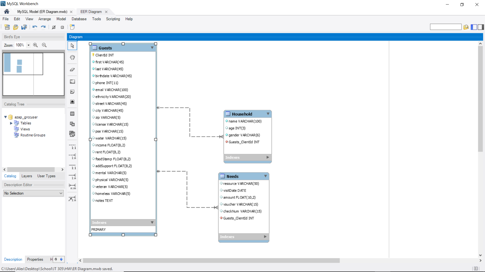

# StJamesOutreach

St. James Outreach is a private web page that is used by volunteer at St. James.
It is used for the easy input of guests that visit the outreach center.
Whatever information they think is necessary can be stored for later use and
tracking for the outreach center. 

##Implementation
**MVC and routing -** We used the Model-View-Controller paradigm
and the F3 framework for this project. With this we were able to
easily make a route for each page using the index and routing them all together that way.
For the MVC we used that to seperate the database information from the busniess
logic but setting them in different places and accessing them if needed through the index.

**Database using PDO -** For the database we used the Php Data Object to 
prepare and exectue the sql statements. Either inserting new guests into
the database or selecting existing ones to preview on the view 
guest page.

**Commiting -** Both members put in equal amount of work
[List of Commits](https://github.com/ashornal/StJamesOutreach/commits/master).

**OOP -** Used Object-oriented programming for each guest input. Php Docblocks are
present for each class.

**Validation -** Located under model/validation.php

**jQuery and Ajax -** Used at members and vouchers to each user that has
been created. JQuery was used to add the input field each time the button is 
clicked, creating a new input field with a unique id/name. Ajax
was the used to send the array of the inputs to the index.php from the newGuest.
This way we could pull each peice from the array and store it into the database
for later reference.

